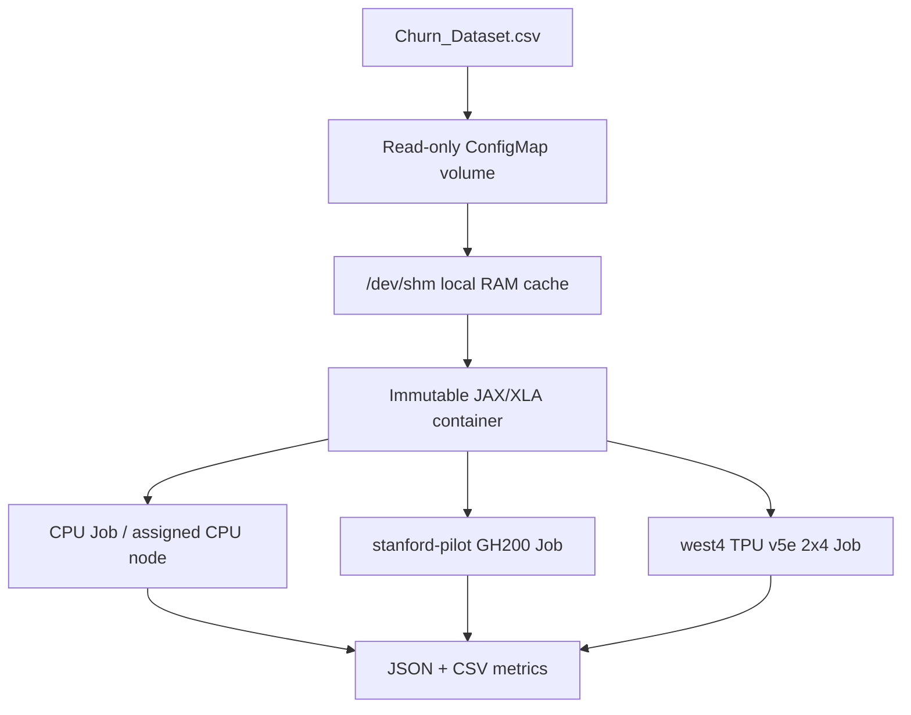

# ME344 Option 1 — Portable Churn DNN Benchmark

This repository packages a JAX/XLA multi-layer perceptron (16 input features → 64 → 32 → 1) for telecom churn classification. The same model, seed, 70/15/15 stratified split, 200 epochs, and batch size run on three distinct resources: the assigned CPU node, the `stanford-pilot` GH200 GPU, and the GKE `tpu-v5-lite-podslice` 2x4 TPU v5e slice.

The submitted benchmark is deliberately small (5,000 data rows plus a CSV header), so accelerator compilation and host-to-device transfer can be an important fraction of total latency. The project separately records cold-start/XLA compilation time and steady-state training step time.

## System topology



## Repository layout

| Path | Purpose |
|---|---|
| `src/train.py` | DNN, deterministic preprocessing, JIT training, metrics and native telemetry capture |
| `Dockerfile` | Parameterized immutable CPU/GPU/TPU image recipe |
| `infra/` | ConfigMap and reusable Kubernetes Jobs |
| `scripts/` | Build, submission, and collection helpers |
| `data/Churn_Dataset.csv` | Original course dataset; mounted at runtime rather than copied into the image |
| `results/` | Commit the final JSON/CSV/logs/plots after each benchmark |

## Before running

On your assigned `hpcc-cluster-58`, clone this repository and authenticate to the course project. Set your unique team value once per shell:

```bash
export PROJECT=soe-hpccenter
export REGISTRY_REGION=us-central1
export TPU_CLUSTER_REGION=us-west4
export TEAM=ways-58
chmod +x scripts/*.sh
```

### Build images

Build one target at a time. If your account still has the Cloud Build permission error seen in Lab 2, stop there and ask the course staff to grant the documented build access or provide the course-approved build route; do not install packages manually on a running Pod.

```bash
scripts/build_images.sh cpu
# Later, only immediately before the corresponding run:
scripts/build_images.sh gpu
scripts/build_images.sh tpu
```

The last command creates an ARM64 image for the GH200. Before using it, compare it with Lab 1’s verified `stanford-pilot` image-pull method. If Lab 1 uses a different registry or architecture procedure, retain this project’s `gpu-job.yaml` but substitute that known-good image build/push command.

## Run the three comparable benchmarks

Use the same `RUN_ID` only if you want records to share a timestamp. Each Kubernetes context has its own ConfigMap, so create it after switching contexts.

### 1. CPU baseline on the assigned class server

After logging into your assigned class Linux server, first prove the image and training entry point work with a one-epoch check. Then run the required 200-epoch baseline. Both commands build and run the immutable CPU container; no packages are installed on the running node. The course server provides Docker-compatible rootless Podman without CPU/cpuset cgroup controllers, so this baseline uses the assigned node and records its visible logical CPUs, actual process CPU use, and peak memory in the result telemetry rather than claiming an unenforced core limit.

```bash
scripts/run_cpu.sh verify
scripts/run_cpu.sh benchmark
```

### 2. GH200 GPU

```bash
kubectl config use-context student58-context
export KUBE_NAMESPACE=ns-student58
scripts/create_configmap.sh
scripts/build_images.sh gpu
scripts/submit_benchmark.sh gpu
kubectl -n "$KUBE_NAMESPACE" get pods -w
scripts/collect_results.sh churn-gpu-${TEAM}-<RUN_ID>
```

Only one physical GPU exists. A `Pending` GPU Job means it is busy; inspect it, but never delete another student’s Job. The manifest requests exactly one `nvidia.com/gpu` and no TPU.

### 3. TPU v5e

```bash
gcloud container clusters get-credentials class-tpu-cluster-west4 --region=us-west4 --project=soe-hpccenter
kubectl config use-context gke_soe-hpccenter_us-west4_class-tpu-cluster-west4
export KUBE_NAMESPACE=default
scripts/create_configmap.sh
scripts/build_images.sh tpu
scripts/submit_benchmark.sh tpu
kubectl get workloads
scripts/collect_results.sh churn-tpu-${TEAM}-<RUN_ID>
kubectl delete job churn-tpu-${TEAM}-<RUN_ID>
```

The TPU Job requests `google.com/tpu: 8`, selector `tpu-v5-lite-podslice`, topology `2x4`, and the required `student-queue` label. `ADMITTED: True` with a Pending pod is normal while Autopilot starts the TPU node.

## Measurements to report

Every run emits JSON and appends a row to `benchmark_summary.csv`. Record these values in the final table:

| Hardware | Compile seconds | Mean step ms | P95 step ms | Steps/s | Test accuracy | Test ROC-AUC | Utilization evidence |
|---|---:|---:|---:|---:|---:|---:|---|
| Assigned CPU node | 0.3202 | 2.2956 | 2.2103 | 431.27 | 0.8667 | 0.7103 | 32 logical CPUs visible; 3.98% of node CPU capacity averaged; 431.54 MiB peak RSS |
| GH200 | pending | pending | pending | pending | pending | pending | `nvidia-smi` captured in JSON |
| TPU v5e (8 chips) | pending | pending | pending | pending | pending | pending | `tpu-info --streaming --rate 2` screenshot/log |

The deterministic split means predictive metrics should be close across devices. If they are not, record the mismatch instead of silently comparing different runs.

The CPU figure above is the measured 200-epoch run `cpu-ways-58-20260813-062851`. Rootless Podman exposed all 32 logical CPUs because the course host does not provide CPU/cpuset cgroup controllers. Process CPU time divided by wall time corresponds to about 1.27 logical cores on average (3.98% of the 32-core-visible capacity). The row is therefore labeled as the assigned CPU node, not as a four-core run.

## Bottleneck hypothesis and mitigation

At this dataset size, the likely bottleneck is fixed overhead: image start-up, data transfer, and XLA compilation outweigh dense-matrix arithmetic. A GH200/TPU can therefore show lower steady-state step time without lower end-to-end wall time. The evidence must decide this conclusion.

Mitigations to test after the baseline are: (1) cache the mounted CSV in `/dev/shm`, already implemented; (2) increase batch size within device memory; (3) run more epochs or a larger dataset to amortize compilation; and (4) on TPU test bfloat16 in a separately labeled experiment. Do not mix an optimized experiment with the fair float32 baseline table.

## Reproducibility and cleanup

Commit source, manifests, requirements, README, final `results/` summaries, and your 5-slide PDF/PPT. Never commit secrets, kubeconfig, GCP credentials, or a W&B key. When a GPU/TPU run is captured, delete only your own completed Job to free shared capacity.
