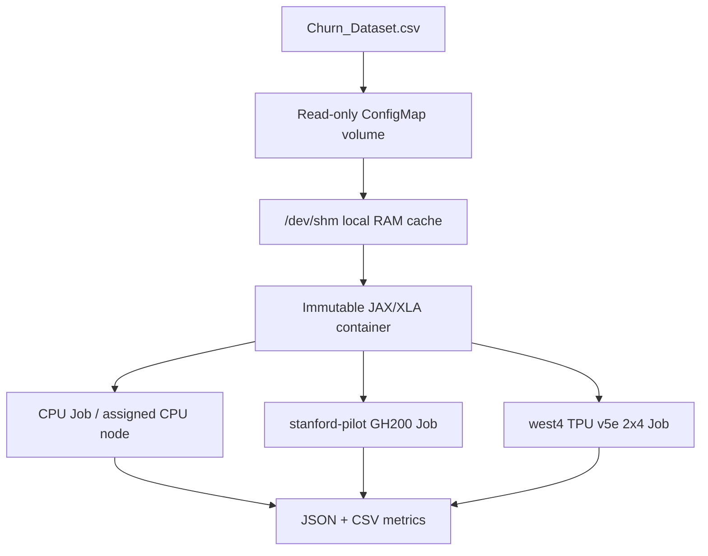
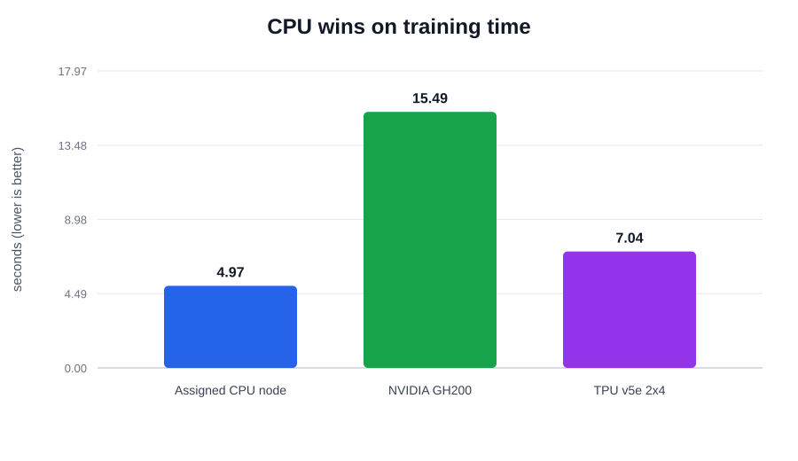
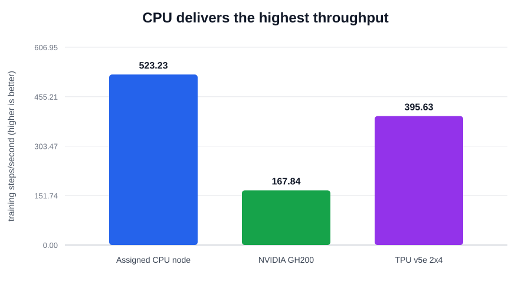
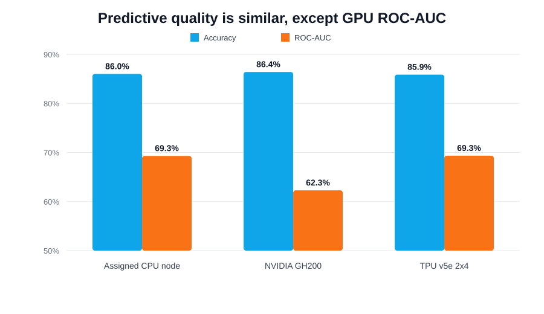

# ME344 Option 1 — Portable Churn DNN Benchmark

## Executive summary

This repository packages a JAX/XLA multi-layer perceptron (16 input features → 64 → 32 → 1) for telecom churn classification. The same model, seed, 70/15/15 stratified split, 200 epochs, and batch size run on three distinct resources: the assigned CPU node, the `stanford-pilot` GH200 GPU, and the GKE `tpu-v5-lite-podslice` 2x4 TPU v5e slice.

The submitted benchmark is deliberately small (5,000 data rows plus a CSV header), so accelerator compilation and host-to-device transfer can be an important fraction of total latency. The project separately records cold-start/XLA compilation time and steady-state training step time.

## System topology diagram



## Repository layout

| Path | Purpose |
|---|---|
| `src/train.py` | DNN, deterministic preprocessing, JIT training, metrics and native telemetry capture |
| `Dockerfile` | Parameterized immutable CPU/GPU/TPU image recipe |
| `infra/` | ConfigMap and reusable Kubernetes Jobs |
| `scripts/` | Build, submission, and collection helpers |
| `docs/ME344_Profiling_Analysis.ipynb` | Executable three-platform profiling analysis sourced from the formal JSON artifacts |
| `data/Churn_Dataset.csv` | Original course dataset; mounted at runtime rather than copied into the image |
| `results/` | Raw JSON/CSV/log evidence, the final three-row summary, and generated charts |

## Before running

On your assigned `hpcc-cluster-58`, clone this repository and authenticate to the course project. Set your unique team value once per shell:

```bash
export PROJECT=soe-hpccenter
export REGISTRY_REGION=us-central1
export TPU_CLUSTER_REGION=us-west4
export TEAM=ways-58
chmod +x scripts/*.sh
```

### Build images

Build one target at a time. The TPU image follows Lab 2's course-approved local Podman build and Artifact Registry push route; do not install packages manually on a running Pod.

```bash
scripts/build_images.sh cpu
# Later, only immediately before the corresponding run:
scripts/build_images.sh gpu
scripts/build_images.sh tpu
```

The GPU command creates a no-`RUN` ARM64 overlay on NVIDIA's JAX image for the GH200, following Lab 1's verified `stanford-pilot` Job and image-pull model. The TPU command builds an x86_64 JAX/libtpu image on the class server following Lab 2.

## Run the three comparable benchmarks

Use the same `RUN_ID` only if you want records to share a timestamp. Each Kubernetes context has its own ConfigMap, so create it after switching contexts.

### 1. CPU baseline on the assigned class server

After logging into your assigned class Linux server, first prove the image and training entry point work with a one-epoch check. Then run the required 200-epoch baseline. Both commands build and run the immutable CPU container; no packages are installed on the running node. The course server provides Docker-compatible rootless Podman without CPU/cpuset cgroup controllers, so this baseline uses the assigned node and records its visible logical CPUs, actual process CPU use, and peak memory in the result telemetry rather than claiming an unenforced core limit.

```bash
scripts/run_cpu.sh verify
scripts/run_cpu.sh benchmark
```

### 2. GH200 GPU

```bash
kubectl config use-context student58-context
export KUBE_NAMESPACE=ns-student58
scripts/create_configmap.sh
scripts/build_images.sh gpu
scripts/submit_benchmark.sh gpu
kubectl -n "$KUBE_NAMESPACE" get pods -w
scripts/collect_results.sh churn-gpu-${TEAM}-<RUN_ID>
```

Only one physical GPU exists. A `Pending` GPU Job means it is busy; inspect it, but never delete another student’s Job. The manifest requests exactly one `nvidia.com/gpu` and no TPU.

### 3. TPU v5e

```bash
gcloud container clusters get-credentials class-tpu-cluster-west4 --region=us-west4 --project=soe-hpccenter
kubectl config use-context gke_soe-hpccenter_us-west4_class-tpu-cluster-west4
export KUBE_NAMESPACE=default
scripts/create_configmap.sh
scripts/build_images.sh tpu
scripts/submit_benchmark.sh tpu
kubectl get workloads
scripts/collect_results.sh churn-tpu-${TEAM}-<RUN_ID>
kubectl delete job churn-tpu-${TEAM}-<RUN_ID>
```

The TPU Job requests `google.com/tpu: 8`, selector `tpu-v5-lite-podslice`, topology `2x4`, and the required `student-queue` label. `ADMITTED: True` with a Pending pod is normal while Autopilot starts the TPU node.

## Performance delta analysis

Every run emits JSON and CSV records. `scripts/summarize_results.py` rebuilds the final comparison and charts directly from the three selected 200-epoch JSON artifacts:

```bash
python3 scripts/summarize_results.py
```

| Hardware | Compile (s) | Training (s) | End-to-end (s) | Mean step (ms) | P95 step (ms) | Steps/s | Accuracy | ROC-AUC |
|---|---:|---:|---:|---:|---:|---:|---:|---:|
| Assigned CPU node | 0.2318 | 4.9691 | 6.3631 | 1.8966 | 1.8278 | 523.23 | 0.8600 | 0.6930 |
| NVIDIA GH200 | 0.5377 | 15.4911 | 18.8684 | 5.9199 | 12.4933 | 167.84 | 0.8640 | 0.6228 |
| TPU v5e 2x4 (8 chips) | 0.1754 | 7.0438 | 12.3209 | 2.6982 | 2.7482 | 369.12 | 0.8587 | 0.6934 |







The deterministic split makes the CPU and TPU predictive metrics nearly identical. The GH200 run reached similar accuracy but lower ROC-AUC; that observed mismatch is retained rather than replaced or normalized away. JAX versions also differed: CPU and TPU used 0.6.2, while the course NVIDIA runtime supplied `0.4.38.dev20250115+838500378`.

The selected artifacts are `cpu-ways-58-20260813-070716`, `churn-gpu-ways-58-20260813-074833`, and `churn-tpu-ways-58-telemetry-final2-20260813-211541`. Each executed 200 epochs and 2,600 timed steps with the same seed, split, batch size, float32 model, and preprocessing path. Validation and failed telemetry checks are retained only as raw debugging evidence and are excluded from the three-row comparison.

Rootless Podman exposed all 32 logical CPUs because the course host does not provide CPU/cpuset cgroup controllers. Process CPU time divided by wall time corresponds to about 1.20 logical cores on average (3.73% of the 32-core-visible capacity). The row is therefore labeled as the assigned CPU node, not as a four-core run. The earlier `062851` run used the superseded sklearn preprocessing pipeline and is excluded.

The formal GPU Job used the public immutable GHCR image `ghcr.io/stephaniewy/hpc_churn_dataset_wang-gpu@sha256:c4ff36e4f45a8fe2f7455f35c5fccbf0f80510505ad9ca1b2217c18cfeb22882`. With JAX preallocation disabled, `nvidia-smi` samples averaged 1% GPU utilization, peaked at 2%, and reported 650 MiB peak VRAM. The formal TPU Pod used `us-central1-docker.pkg.dev/soe-hpccenter/tpu-images/churn-tpu-ways-58@sha256:d39d82614c25dbdfbc85a56c3fb2e27f4856130dc7da2bd463b591f19f751f6c` and exposed all eight expected devices. Automated `tpu-info` samples averaged 2.50% duty cycle and peaked at 30.05%; only core 0 registered nonzero work in the final sample, which demonstrates that this implementation did not shard the small MLP across the eight-chip slice. `tpu-info` reported 0.00 GiB used of 15.75 GiB HBM per device. That value is preserved as observed but treated as a runtime sampling limitation—not as proof that training allocated no accelerator memory.

Input processing was not the bottleneck: data loading took 0.0593 s on CPU, 0.0355 s on GPU, and 0.0367 s on TPU; device transfer took 0.0016 s, 0.0082 s, and 0.0044 s respectively. The ConfigMap is copied into `/dev/shm` before training, keeping the timed loop independent of network or control-plane storage latency.

## Infrastructure bottleneck diagnosis

The measured bottleneck is workload size rather than accelerator capacity. The 5,000-row, 16-feature MLP does too little matrix work per step to amortize accelerator dispatch and synchronization. CPU training was 3.12x faster than GH200 training and 1.42x faster than the eight-chip TPU; CPU end-to-end time was also lowest. The GH200's 1% mean utilization and the TPU's 2.50% mean duty cycle reinforce the underutilization diagnosis.

## Engineering mitigations

For this telecom churn workload, the assigned CPU is the practical deployment and periodic-retraining choice: it is fastest here and avoids reserving scarce accelerators. GPU or TPU becomes defensible only after materially increasing model width, dataset size, batch size, retraining frequency, or concurrent workload volume. Predictive feasibility also needs business validation: accuracy alone can hide minority-class errors, while ROC-AUC near 0.69 indicates only moderate ranking quality. A production retention workflow should select a decision threshold using false-positive offer cost, false-negative churn loss, calibration, and drift monitoring.

Possible separately labeled scaling experiments include larger batches, repeated or larger datasets, wider networks, and TPU bfloat16. They are not mixed into this fair float32 baseline.

## Reproducibility and cleanup

Commit source, manifests, requirements, README, final `results/` summaries, and your 5-slide PDF/PPT. Never commit secrets, kubeconfig, GCP credentials, or a W&B key. When a GPU/TPU run is captured, delete only your own completed Job to free shared capacity.
